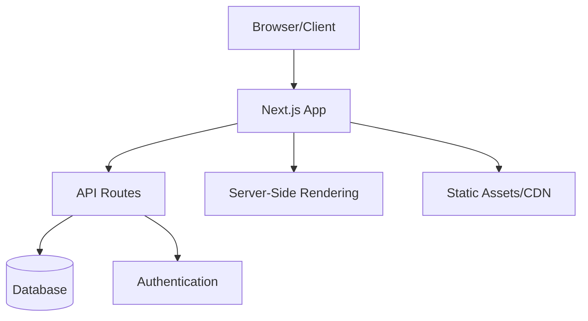
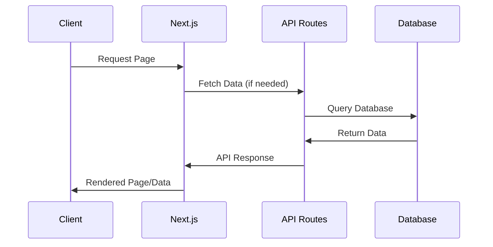
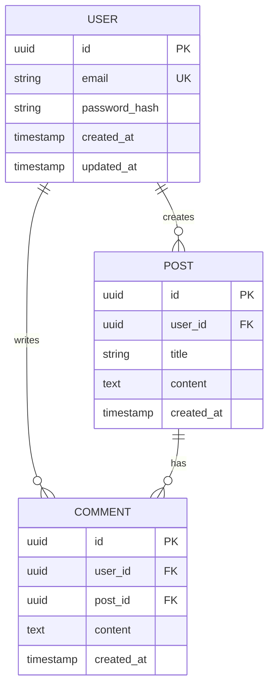
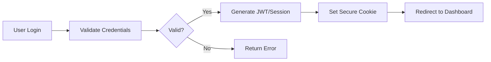
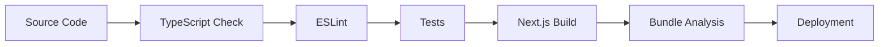

# 🏗️ Architecture Overview

> **System-Architektur und Design-Entscheidungen für [PROJECT_NAME]**

## 📋 System Overview

### High-Level Architecture


### Technology Stack
| Layer | Technology | Purpose |
|-------|-----------|---------|
| **Frontend** | Next.js 15, React, TypeScript | User Interface & Interactions |
| **Styling** | [STYLING_FRAMEWORK] | UI Styling & Components |
| **Backend** | Next.js API Routes | Server-side Logic & APIs |
| **Database** | [DATABASE_TYPE] | Data Persistence |
| **Authentication** | [AUTH_PROVIDER] | User Management & Security |
| **Deployment** | [DEPLOYMENT_PLATFORM] | Hosting & CI/CD |

## 🏛️ Application Architecture

### Next.js App Router Structure
```
src/app/
├── (auth)/              # Authentication routes
│   ├── login/
│   └── register/
├── (dashboard)/         # Protected dashboard routes
│   ├── dashboard/
│   └── settings/
├── api/                 # API endpoints
│   ├── auth/
│   ├── users/
│   └── [feature]/
├── globals.css          # Global styles
├── layout.tsx          # Root layout
└── page.tsx            # Homepage
```

### Component Architecture
```
src/components/
├── ui/                  # Base UI Components
│   ├── Button.tsx       # Reusable button component
│   ├── Input.tsx        # Form input component
│   └── Modal.tsx        # Modal component
├── features/            # Feature-specific components
│   ├── auth/           # Authentication components
│   ├── dashboard/      # Dashboard components
│   └── profile/        # User profile components
└── layout/             # Layout components
    ├── Header.tsx
    ├── Footer.tsx
    └── Sidebar.tsx
```

## 🔄 Data Flow

### Client-Server Interaction


### State Management
```typescript
// Global State Architecture
interface AppState {
  user: User | null;           // Authentication state
  ui: UIState;                 // UI state (modals, loading, etc.)
  [feature]: FeatureState;     // Feature-specific state
}

// State Management Options:
// - React Context (for simple state)
// - Zustand (for complex state)
// - React Query (for server state)
```

## 🗄️ Database Design

### Data Model Overview


### Database Schema
```sql
-- Beispiel Schema (anpassen je nach Projekt)
CREATE TABLE users (
  id UUID PRIMARY KEY DEFAULT gen_random_uuid(),
  email VARCHAR(255) UNIQUE NOT NULL,
  password_hash VARCHAR(255) NOT NULL,
  created_at TIMESTAMP DEFAULT CURRENT_TIMESTAMP,
  updated_at TIMESTAMP DEFAULT CURRENT_TIMESTAMP
);
```

## 🔐 Security Architecture

### Authentication Flow


### Security Measures
- **Authentication**: [AUTH_METHOD] (NextAuth.js, Custom JWT, etc.)
- **Authorization**: Role-based access control (RBAC)
- **Data Protection**: Input validation, SQL injection prevention
- **Transport**: HTTPS, secure cookies
- **Headers**: CSP, HSTS, CSRF protection

## 📡 API Design

### RESTful API Structure
```
GET    /api/users           # Get all users
POST   /api/users           # Create user
GET    /api/users/:id       # Get specific user
PUT    /api/users/:id       # Update user
DELETE /api/users/:id       # Delete user

POST   /api/auth/login      # User login
POST   /api/auth/logout     # User logout
POST   /api/auth/refresh    # Refresh token
```

### API Response Format
```typescript
// Standard API Response
interface ApiResponse<T> {
  success: boolean;
  data?: T;
  error?: {
    code: string;
    message: string;
    details?: any;
  };
  meta?: {
    pagination?: {
      page: number;
      limit: number;
      total: number;
    };
  };
}
```

## 🎨 UI/UX Architecture

### Design System Structure
```
src/styles/
├── globals.css          # Global styles & CSS variables
├── components.css       # Component-specific styles
└── utilities.css        # Utility classes

Design Tokens:
├── Colors               # Brand colors, semantic colors
├── Typography           # Font families, sizes, weights
├── Spacing              # Margins, paddings, gaps
├── Shadows              # Box shadows, elevations
└── Breakpoints          # Responsive breakpoints
```

### Component Hierarchy
```
Layout Components (Header, Footer, Sidebar)
├── Page Components (Dashboard, Profile, Settings)
    ├── Feature Components (UserList, PostEditor)
        ├── UI Components (Button, Input, Modal)
            └── Base Elements (Typography, Icons)
```

## 🚀 Performance Architecture

### Optimization Strategies
- **Rendering**: SSG for static content, SSR for dynamic content, CSR for interactive parts
- **Code Splitting**: Route-based and component-based splitting
- **Image Optimization**: Next.js Image component with automatic optimization
- **Caching**: Browser cache, CDN cache, API response cache
- **Bundle Optimization**: Tree shaking, dead code elimination

### Performance Monitoring
```typescript
// Core Web Vitals Tracking
export function trackWebVitals({ id, name, value }: Metric) {
  // Send to analytics service
  analytics.track('Web Vitals', {
    metric: name,
    value: value,
    id: id
  });
}
```

## 🔧 Development Architecture

### Build Process


### Environment Setup
```typescript
// Environment Configuration
const env = {
  development: {
    DATABASE_URL: 'postgresql://localhost:5432/myapp_dev',
    API_URL: 'http://localhost:3000/api',
    LOG_LEVEL: 'debug'
  },
  production: {
    DATABASE_URL: process.env.DATABASE_URL,
    API_URL: process.env.API_URL,
    LOG_LEVEL: 'error'
  }
};
```

## 📊 Monitoring & Observability

### Logging Strategy
```typescript
// Structured Logging
interface LogEntry {
  level: 'debug' | 'info' | 'warn' | 'error';
  message: string;
  timestamp: string;
  userId?: string;
  requestId?: string;
  metadata?: Record<string, any>;
}
```

### Metrics Collection
- **Application Metrics**: Response times, error rates, throughput
- **Business Metrics**: User registrations, feature usage, conversions
- **Infrastructure Metrics**: Server performance, database performance

## 🔄 Deployment Architecture

### CI/CD Pipeline
```yaml
# Example GitHub Actions Workflow
name: Deploy
on:
  push:
    branches: [main]

jobs:
  deploy:
    runs-on: ubuntu-latest
    steps:
      - uses: actions/checkout@v3
      - run: npm ci
      - run: npm run test
      - run: npm run build
      - run: npm run deploy
```

### Infrastructure
- **Hosting**: [DEPLOYMENT_PLATFORM] (Vercel, Netlify, AWS, etc.)
- **Database**: [DATABASE_HOSTING] (Supabase, PlanetScale, AWS RDS, etc.)
- **CDN**: Edge caching for static assets
- **Monitoring**: Error tracking, performance monitoring

---

## 🎯 Architecture Decisions (ADRs)

### ADR-001: Frontend Framework
**Decision**: Next.js 15 with App Router  
**Reason**: Full-stack React framework with excellent DX, SSR/SSG capabilities, and built-in optimizations  
**Alternatives Considered**: Vite + React, Remix, SvelteKit  

### ADR-002: Styling Solution
**Decision**: [STYLING_DECISION]  
**Reason**: [REASONING]  
**Alternatives Considered**: [ALTERNATIVES]  

### ADR-003: State Management
**Decision**: [STATE_MANAGEMENT_DECISION]  
**Reason**: [REASONING]  
**Date**: [DATE]

---

**📅 Last Updated:** [LAST_UPDATE_DATE]  
**👤 Architecture Owner:** [ARCHITECT_NAME]  
**🔄 Review Schedule:** Quarterly architecture reviews

## 🤖 AI-Chat Integration

**Architecture References:**
```
"Erkläre die Architektur aus @docs/architecture/OVERVIEW.md"
"Implementiere Feature X nach @docs/architecture/OVERVIEW.md"
"Überprüfe Design gegen @docs/architecture/OVERVIEW.md"
```

**Related Documents:**
- **[Architecture Decisions](DECISIONS.md)** → Detailed ADRs
- **[Data Flow](DATA_FLOW.md)** → Detailed data flow diagrams
- **[Security](../security/GUIDELINES.md)** → Security implementation details 